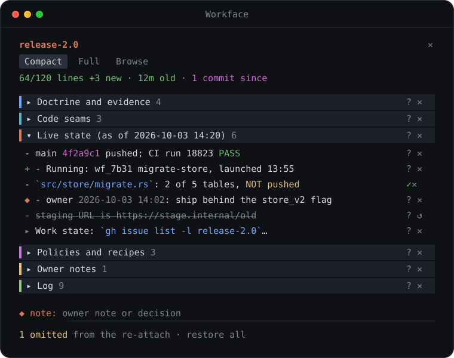

<p align="center">
  
</p>

<p align="center">
  <a href="https://github.com/scodge-24/workface/actions/workflows/ci.yml"></a>
  
  <a href="LICENSE"></a>
</p>

**Live-editable compaction for Claude Code.** A long-running agent loses the thread when its context compacts.
Workface keeps the agent's working notes and hands them back right after every compaction summary, auto or manual.
The notes sit in a panel beside the transcript, so you watch them change as the agent works and edit what it
will wake up with, before the next compaction lands.

A **workface** is a short, links-first scratch file (at most 120 lines) at
`~/.claude/workface/<tranche>/workface.md`: where things are, what is true now, and a dated log. An agent
that orchestrates a long piece of work (a *tranche*) keeps it current. When the conversation compacts, the
mod makes sure the agent wakes up holding it, and the summary spends its words on what the workface doesn't say.

## Watch and steer it live

<p align="center">
  
</p>

- **See what it will remember.** The panel shows the workface as the agent writes it. `+` marks lines written
  since the last compaction, and the header shows the line budget, the file's age and commits it hasn't
  recorded yet. `Full` shows exactly what the summarizer and the agent will receive.
- **Cut what's wrong.** `✕` keeps a stale or mistaken line out of what the agent gets back after compaction,
  without touching the file. `↺` puts it back.
- **Add what's yours.** `◆ note` writes your decision into the workface, marked as yours in a way no agent can forge.
- **Ask about anything.** `?` puts a line or a whole section on your next prompt.

## Install

The repository is its own marketplace:

```bash
claude plugin marketplace add scodge-24/workface
claude plugin install workface@workface
```

Or from a session: `/plugin install workface --marketplace scodge-24/workface`. Needs Claude Code v2.1.287 or
later (mods). Run `/reload-plugins` in a session that was open during the install.

### Update

Claude Code leaves auto-update off for a marketplace you add yourself. Turn it on under **Marketplaces** in `/plugin`
(select `workface`, then **Enable auto-update**), or update by hand:

```bash
claude plugin update workface@workface
```

## Quick start

```text
/workface start release-2.0   # writes a skeleton for the agent to fill in
/workface                     # opens the panel beside the transcript
```

Then work as usual. The agent updates the workface as things change, and every compaction from then on, auto or
manual, hands it back right after the summary. A fresh skeleton looks like this:

```markdown
# release-2.0 — workface (read first after compaction)

Repo(s): `<path>`. Brief: `<path>` (§ index below), or none.

## Doctrine and evidence (links only)
- `<path>` — <what it settles; which § matter>

## Code seams
- `<path>` — <symbols that matter; one known trap>

## Live state (as of 2026-10-03 14:20)
- HEAD / remote: <sha> (<pushed?>; CI <run id, result>)
- Running: <agent/workflow id — what — launched when — what to check on return>
- Work state: <the tracker query that lists it, or: open owner decisions, parked, next in order>

## Policies and recipes
- <push/verify gate, concurrency limits, commands that bit before>

## Log
- 2026-10-03 14:20 — workface started
```

## Use

| Command | Does |
|---|---|
| `/workface start <tranche>` | Creates the workface from a skeleton and attaches this session to it |
| `/workface attach <tranche>` | Joins an existing tranche and shows the agent its workface |
| `/workface resume` | Shows the attached workface again |
| `/workface log <entry>` | Appends `- YYYY-MM-DD HH:MM — <entry>` to `## Log`, stamped with the local time |
| `/workface detach` | Stops this session orchestrating it; the files stay |
| `/workface` | Opens or closes the panel |

The agent has the same verbs as the tool `mcp__workface__workface`, so it can start or join a tranche when you
ask it to. The protocol it is handed has it log through `log`, so log times come from the clock, not from the
agent's guess. A subagent is refused: it shares its parent's session id and would re-point it.

## What it does

**Through compaction**

- **Briefs the summarizer** on every compaction (manual, auto, plugin-started and precomputed) with the exact
  workface text that will follow the summary, so the summary records only what the workface does not hold.
  Above 12k characters the summarizer gets the section headings alone, since that request runs near the
  context limit.
- **Re-attaches the workface** right after the summary, read fresh at that moment, labelled as automated
  context rather than a message from you, with the update and prune protocol.
- **Asks for a flush** once, at 80% of the auto-compact threshold, so the agent writes down what it knows first.
- **Attaches on resume** and leaves a subagent's own compactions alone.

**The panel** (docked beside the transcript in fullscreen, inline above the prompt otherwise), modelled on the
`/diff` panel. Beyond the controls above:

- `Compact` puts sections on coloured bands; click one to expand it, and a long line opens in full from its `▸`.
  An ask shows `✓` while pending and is taken back by a second press; it rides your next prompt once.
- Owner notes go under `## Owner notes`. The mod records which lines you wrote and marks only those
  (`⟨owner, verified by the workface mod⟩`) when it hands the workface over, after stripping that mark from
  every other line.
- `Browse` lists every tranche, the sessions running on it, its age and size.

Colours are theme keys, so the panel follows your Claude Code theme; the `status_line` option repeats the
header's stats in the status line.

## Configure

Colours are plugin options, shown as rows in `/config` (or set under `pluginConfigs` in `settings.json`):
`color_accent`, `color_sha`, `color_code`, `color_time`, `color_good`, `color_warn`, `color_bad`. Each takes a
Claude Code theme key (`success`, `warning`, `merged`, …), a terminal colour name (`magenta`, `cyan`, …) or a
hex colour (`#ff79c6`). Unset, they follow your theme. To match a statusline that shows git in magenta:

```json
"pluginConfigs": { "workface@workface": { "options": { "color_sha": "magenta" } } }
```

`status_line` (off by default) adds the tranche, line budget, age and commits-since to Claude Code's status line.

## Data

Everything stays on your machine. The mod reads and writes files under `~/.claude/workface/`, reads
`~/.claude/sessions/` to show which sessions are running, runs `git log` in the repos a workface names, and
keeps omissions and owner-note records in its plugin store. It makes no network requests. Run
`claude plugin validate` on a checkout to list every call it makes.

## Files

A workface is plain Markdown, and each session marker under `~/.claude/workface/sessions/<session-id>` is one
line holding the workface's path, so other tools and agents can read and keep the same tranche.

## Develop

```bash
claude plugin validate --strict .
claude plugin test .
tsc -p .            # once `claude --plugin-dir .` has loaded it (the engine writes .claude-plugin/types/)
claude --plugin-dir .
```

See `.claude/CLAUDE.md` for the repository's conventions and `.claude/rules/` for what cost time before.
